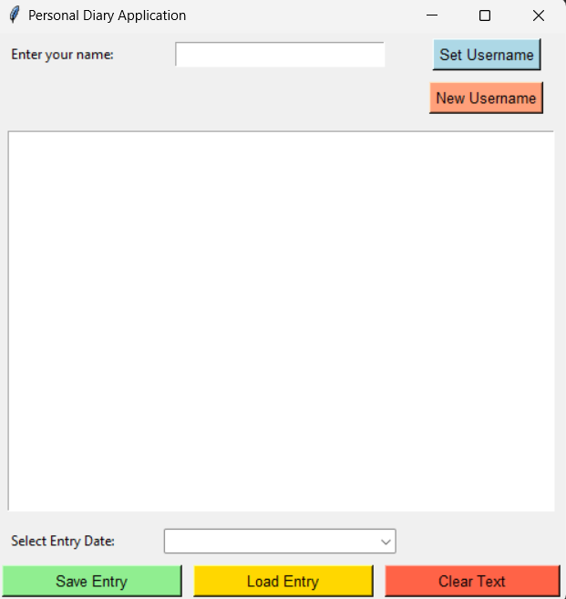
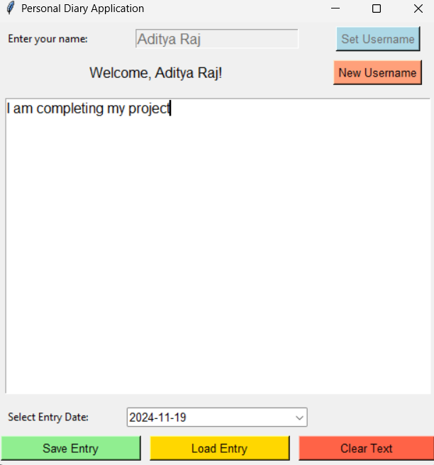
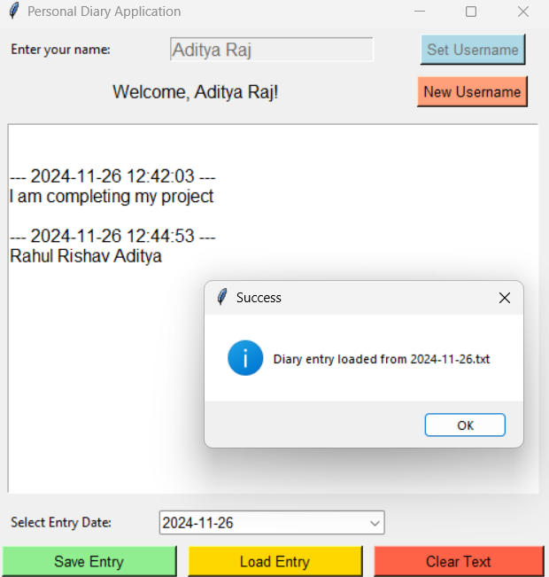

# Personal-Diary-Application

This project is a Personal Diary Application built using Python and the Tkinter library. It allows users to create, save, and retrieve diary entries organized by date. The application stores diary entries locally in a user-specific directory, ensuring ease of access and privacy.

---

## Featues
**1.User-Specific Entries:**

- Users can set their names, and entries are saved in directories named after them.
- Entries for different users are kept separate.
- 
**2. Save Diary Entries:**

- Entries are saved with timestamps in files named by the current date.
- Existing entries for the same date are appended with a new timestamp.

**3.Load Previous Entries:**

- Users can select a past entry by date using a dropdown menu.

**4.Clear Text:**

- Users can clear the text box to start a new entry or edit without interruption.

**5.Switch Users:**

- Users can reset the application to set a new username and start fresh.

**6.Error Handling:**

- Warnings are displayed if users try actions without providing a name or selecting an entry.
---

## Requirements
- Python 3.6 or Later: Ensure Python is installed on your system.
- Tkinter: Tkinter is typically included with Python. If not, install it using:
```bash
sudo apt-get install python3-tk  # For Linux
pip install tk                  # For Windows/Mac (rarely required)
```

- OS Module: Pre-installed in Python for file operations.

## Usage
**1.Start the Application:**
- Run the Python script to launch the diary application:

```bash
python main.py
```
**2.Set Your Name:**

- Enter your name in the input box and click "Set Username".
- Your entries will be stored under a directory named after you in diary_entries/.

**3.Write an Entry:**

- Use the text box to type your diary entry.
- Click "Save Entry" to store it with the current date and timestamp.

**4.Load Previous Entries:**

- Select a date from the dropdown menu and click "Load Entry" to view past entries.

**5.Clear or Reset:**

- Click "Clear Text" to erase the text box.
- Click "New Username" to reset the app and create entries for a new user.

---

## How it works

**1.User Setup:**

- When a username is entered, the application creates a directory for that user in diary_entries/.
- Each entry is saved as a text file named by the current date (YYYY-MM-DD.txt).

**2.Saving Entries:**

- Entries are stored with a timestamp to distinguish between multiple entries on the same date.

**3.Loading Entries:**

- The app scans the user’s directory for .txt files, extracts dates, and populates the dropdown menu.

**4.GUI Functionality:**

- Tkinter provides the user interface, with labels, buttons, text boxes, and a dropdown menu for an intuitive experience.
- This application is a simple yet effective way to manage personal diary entries, combining ease of use with basic file handling operations.

---

## Screenshots
### First Impression


### Insert Entries


### Load Entries

